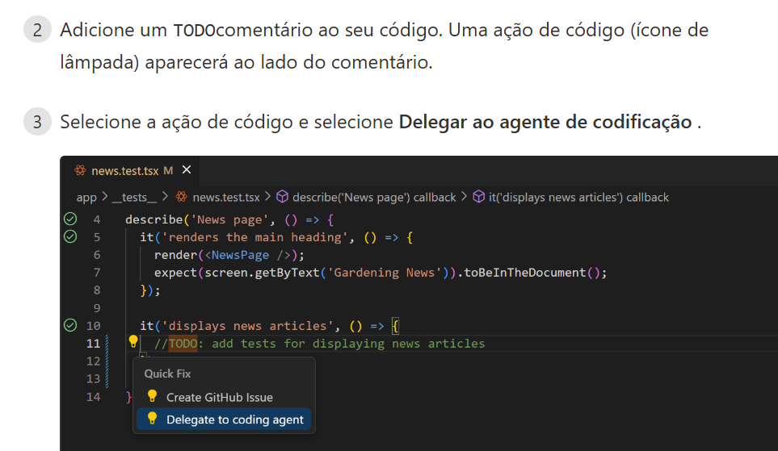
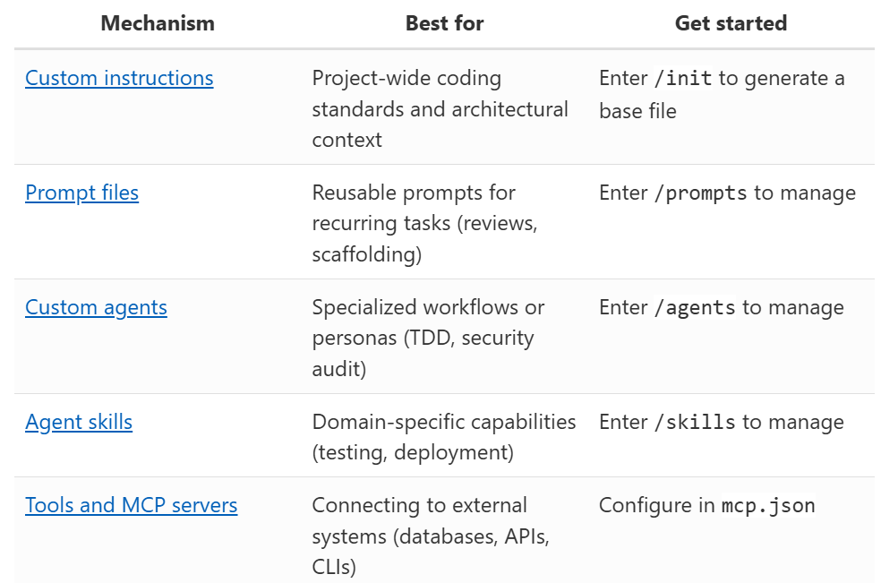

links uteis
[guia passo a passo](https://code.visualstudio.com/docs/copilot/getting-started)
[overview](https://code.visualstudio.com/docs/copilot/overview)


sessão local, nuvem ou segundo plano

divisão de sessão por tarefa diferentes

```
Insira estas informações /initpara configurar seu projeto para IA. Isso cria instruções personalizadas que ajudam o agente a entender sua base de código e gerar um código melhor.
```


./github/copilot-instructions.md
(coding preferences and standards. These apply automatically to all chat interactions.;
your project's structure and coding patterns)

``` markdown
# Example

# Project general coding guidelines

## Code Style
- Use semantic HTML5 elements (header, main, section, article, etc.)
- Prefer modern JavaScript (ES6+) features like const/let, arrow functions, and template literals

## Naming Conventions
- Use PascalCase for component names, interfaces, and type aliases
- Use camelCase for variables, functions, and methods
- Prefix private class members with underscore (_)
- Use ALL_CAPS for constants

## Code Quality
- Use meaningful variable and function names that clearly describe their purpose
- Include helpful comments for complex logic
- Add error handling for user inputs and API calls

```

/init (inicializa o arquivo de instruções. usado uma vez no inicio do proj, e depois ir preenchendo e atualizando)

## Custom agent

para usar, selecione no select do chat (canto direito) e mande o prompt
'Review my full project'


## Smart Action

- msg de commit
- info de PR
- implementar tarefa por comentário (massa)

1. instalar extensão `GitHubull Pull Request`
2 e 3:


[mais ações inteligentes aqui](https://code.visualstudio.com/docs/copilot/copilot-smart-actions)


## Melhores Práticas



- deixar arquivo `copilot-instructions.md` enxuto, apenas com o essencial pois é lido a toda interação do chat
- criar escopos ao inves de centralizar tudo nele.

`/instructions` - Cria arquivos de instruções específicos

ex:

`copilot-instructions-backend.md`
applyTo: "src/backend/**"
- Use async/await for database operations
- Always validate input data
- Log errors with timestamps


`copilot-instructions-tests.md`
applyTo: "**/*.test.js"
- Use descriptive test names
- Follow AAA pattern (Arrange, Act, Assert)
- Mock external dependencies

Vantagem:
Mais organizado: Regras separadas por contexto
Mais eficiente: Copilot aplica apenas as regras relevantes
Mais flexível: Diferentes padrões para diferentes partes do projeto


